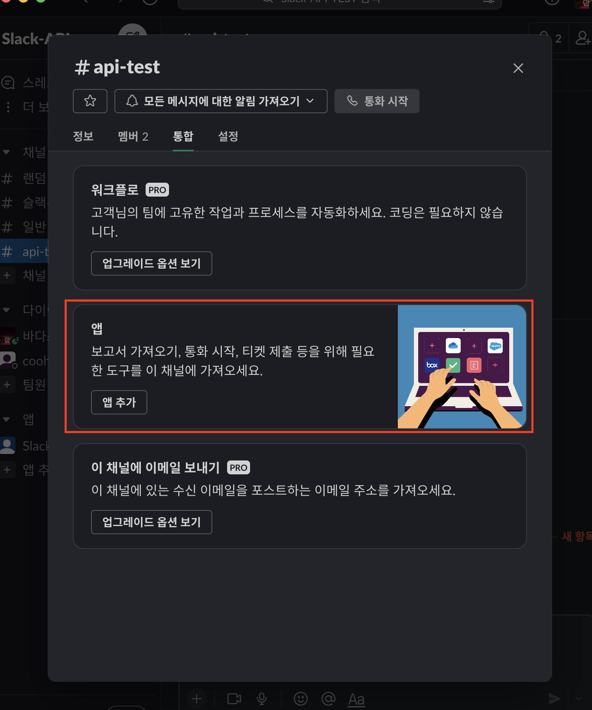
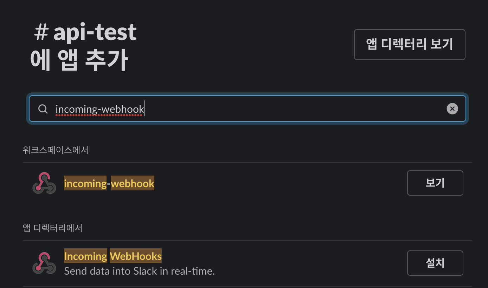
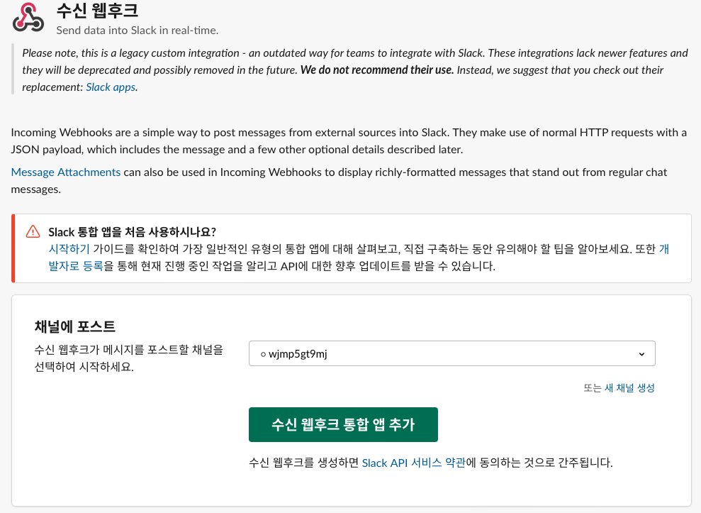
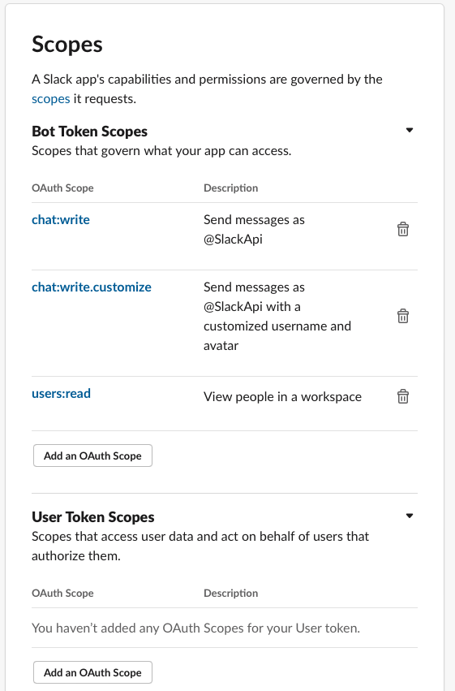

# 웹훅 URL 생성

1. 채널 -> 통합 -> 앱 추가

2. Incomming WebHooks 설치

3. 본인 ID 채널에 포스트

4. 웹후크 URL 복사 및 저장하기

# API Token 생성

1. [Slack API 접속](https://api.slack.com)
2. Create An App
3. From scratch
4. App Name, 워크스페이스지정
5. OAuth & Permissions 메뉴 이동
6. Scopes -> Bot Token Scopes의 Add an Oauth Scope

7. 같은 페이지 install to Workspace
8. Api Token 복사 및 저장

# member ID 확인
1. 본인 프로필의 상태설정 옆의 쩜쩜쩜 클릭
2. 멤버 ID 복사

# Channel ID 확인
1. 채널 오른쪽 클릭
2. 채널 ID 복사

